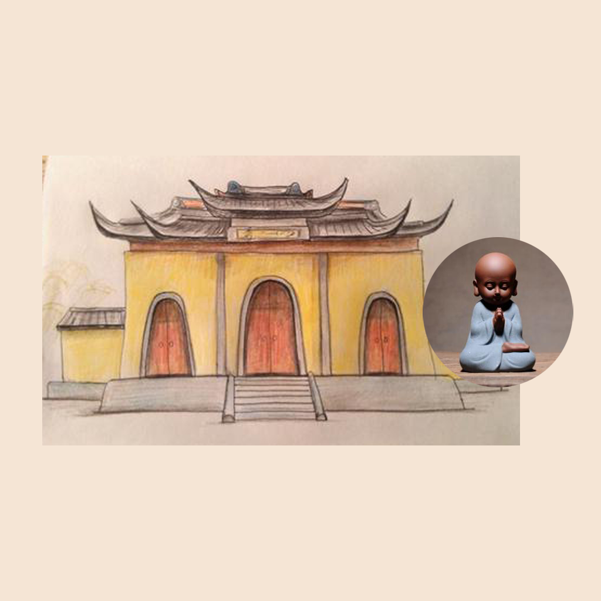

## Welcome to My Buddhist Meditation Record 

Buddhist meditation is a good way to relax. You can enjoy a quiet time at home alone, or you can invite your good friends to go to the Buddhist temple for meditation, sharing and exchanging experiences. You can record the time, place and harvest of each Buddhist meditation, which can be used to inspire yourself and recall, relax yourself, and at the same time, you can also understand more truth and essence of Buddha.

If you have any questions, you can either leave a message or send the questions to our email address.

We will answer them for you in the first time.

### Address: BeatriceArlenexSgPdE@yahoo.com

Thank you!
